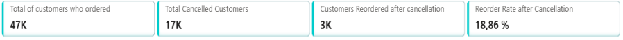
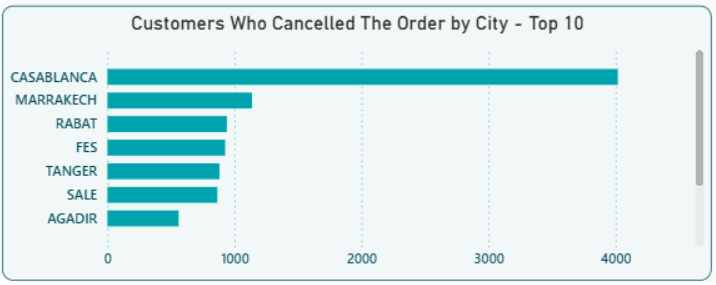
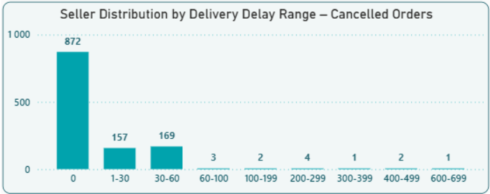
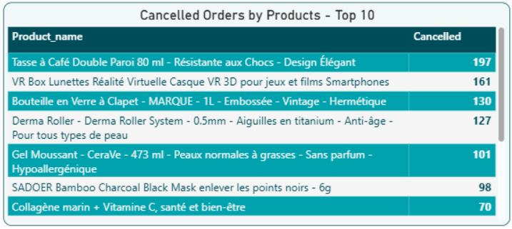
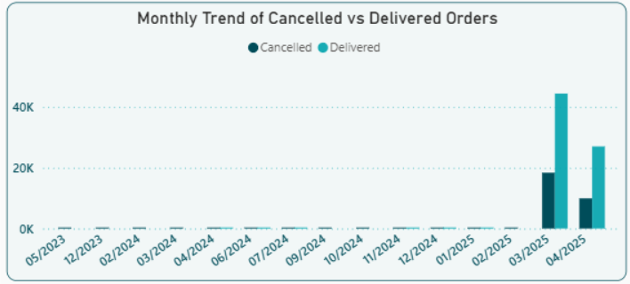

# **Marjane Mall – Cancellation Impact Analysis Project**

## **Project Overview**

This project investigates the impact of order cancellations (“cancellation drop-off”) on customer repeat behavior, based on transactional data from **Marjane Mall**.  
The goal is to understand to what extent cancellations affect a customer’s likelihood to place a new order, and to identify the operational or product-related factors that contribute most to cancellation patterns.

The study combines **Python (Pandas)** for data cleaning, **PostgreSQL** for relational exploration and querying, and **Power BI** for analytical visualization.

---

## **Objectives**

- **Analyze Cancellation Impact**  
  Determine whether order cancellations significantly reduce the probability of customer repeat orders.

- **Perform Data Cleaning & Organization in Python**  
  Use Pandas to clean, format, and preprocess raw data.

- **Model Relationships in PostgreSQL**  
  Export cleaned data into PostgreSQL, establish relational models, and run SQL queries to simplify analysis.

- **Build Power BI Dashboard**  
  Create an interactive dashboard to visualize cancellation behavior across cities, sellers, products, and order statuses.

---

## **Project Structure**

### **1. Data Preparation (Python – Pandas)**

- Cleaning and organizing the datasets using Pandas  
- Handling missing values, duplicates, data types, and date formatting  
- Exporting the cleaned data to CSV for PostgreSQL ingestion  

📁 *The Python script is available in the file:* **[Marjane_cleaning (1).ipynb](Marjane_cleaning%20(1).ipynb)**

---

### **2. Database Setup (PostgreSQL)**

After cleaning, the data was imported into PostgreSQL to:

- Establish table relationships  
- Create primary/foreign keys where possible  
- Run SQL queries supporting the main research questions  
- Prepare aggregated results later used in Power BI  

📁 *SQL queries can be found in the file:* **[Marjane_Queries (1).sql](Marjane_Queries%20(1).sql)**

---

### **3. Power BI Dashboard**

The final analysis and visualization phase was conducted in Power BI in order to have the followed Dashboard : 

#### **Analytical Axes**

- **Seller** → Identify sellers with the highest cancellation impact and delay-induced failures  
- **City** → Detect geographic patterns of cancellations  
- **Order Status** → Compare Delivered vs. Cancelled  
- **Product** → Highlight products most affected by cancellations  

> **Note:**  
> The “Cancellation Reason” dimension was excluded due to a lack of relational constraints (no PK/FK), making it impossible to connect reliably with other datasets.

#### **Key Performance Indicators (KPIs)**

> *“These figures show that around **1 out of 5 customers** returns to place a new order after experiencing a cancellation.  
This is encouraging, yet it still leaves room for improvement.”*

---

## **Data Analysis & Findings**

### **1. Geographic Insights**

Cities with the highest cancellation volumes include:

- Casablanca  
- Marrakech  
- Rabat  

---

### **2. Seller & Product Insights**

Certain sellers show significantly higher cancellation rates, especially those with:

- Frequent delivery delays  
- Operational inefficiencies  

Products with high cancellation frequency were also identified.

 

---

### **3. Payment Mode Behavior**

- **Cash On Delivery (COD)** is the dominant payment method.  
- COD tends to increase cancellation probability since customers can refuse orders upon delivery.

COD was included as an interactive slicer in the dashboard.

---

### **4. Time-Based Trends**

Cancellations are highly concentrated in **February–March 2025**, suggesting:

- Operational disruptions  
- Logistic bottlenecks  
- Seasonal demand fluctuations  

---

## **Recommendations**

✔ **Launch re-engagement campaigns** targeting customers who cancelled orders  
✔ **Monitor and follow up on sellers** with high cancellation rates  
✔ **Investigate frequently cancelled products**  
   - Quality issues  
   - Delivery delays  
   - Pricing inconsistencies  

✔ **Improve logistics** in sensitive cities  
✔ **Reduce delivery delays** to lower cancellation probability  

---

## **Conclusion**

This project demonstrates how combining **Python, SQL, and Power BI** can provide a clear and actionable view of how order cancellations influence customer behavior.

Despite the negative effect of cancellations, the data shows that repeat ordering still occurs — meaning **lost customers can be recovered** with the right strategy.  
A focused approach on seller performance, product reliability, and logistical optimization can significantly improve customer satisfaction and retention.

---

## **Author**

**Taoufik Oulahcen**  
*Data Analyst | Power BI | SQL | Python*  
*Casablanca, Morocco*
